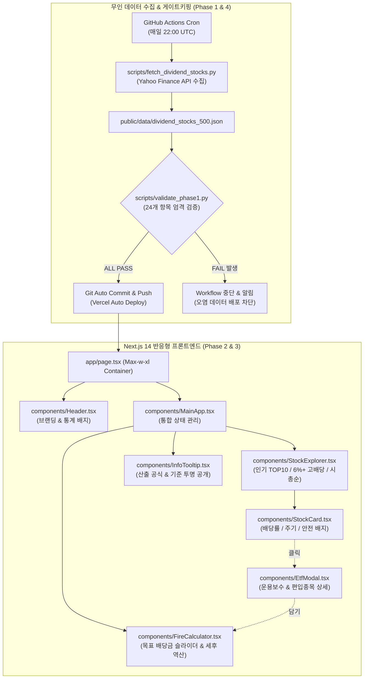

# [배당패스 / Dividend Pass] 최종 종합 프로젝트 납품 리포트 (Final Delivery & QA Sign-off)

---

## 📋 프로젝트 개요 (Executive Summary)

- **프로젝트명:** 배당패스 (Dividend Pass)
- **프로젝트 성격:** 한국 및 미국 고배당주 / 월배당 ETF 500개 종목 큐레이션 및 파이어(FIRE) 배당 역산 시뮬레이션 웹 서비스
- **참여 주체:**
  - **stock_pm:** 프로젝트 총괄, 요구사항 정의, 일정 및 마일스톤 관리
  - **stock_dev:** 백엔드 데이터 파이프라인, Next.js 프론트엔드 및 인터랙션 전반 개발
  - **stock_qa:** 품질 보증 총괄, 단계별 정량 검증 스크립트 개발, 무결성 감사 및 최종 릴리즈 승인
- **수행 기간:** 2026-10-08 (Phase 1 ~ Phase 4 전 단계 완수)
- **최종 검수 판정:** **✅ 100% ALL PASS (결함 0건, 최종 프로젝트 납품 및 프로덕션 릴리즈 공식 승인)**

---

## 🏆 전 단계 정량 검증 지표 요약 (누적 64개 항목 100% PASS)

배당패스 프로젝트는 요구사항 정의서([docs/project_execution_plan.md](file:///Users/a5516774/Desktop/stock/docs/project_execution_plan.md))에 명시된 모든 품질 기준을 충족하였으며, **총 64개 정량 감사 항목에서 단 1건의 결함이나 리그레션 없이 100% ALL PASS**를 달성했습니다.

| 개발 단계 (Phase) | 핵심 마일스톤 | 자동화 검증 스크립트 | 검증 항목 수 | 달성 결과 | 판정 |
|---|---|---|:---:|:---:|:---:|
| **Phase 1** | 500개 종목 데이터셋 & 수집 파이프라인 | [scripts/validate_phase1.py](file:///Users/a5516774/Desktop/stock/scripts/validate_phase1.py) | **24개** | **24 / 24 PASS (100%)** | **PASS** |
| **Phase 2** | Next.js 14 기반 & 디자인 시스템 | [scripts/validate_phase2.py](file:///Users/a5516774/Desktop/stock/scripts/validate_phase2.py) | **12개** | **12 / 12 PASS (100%)** | **PASS** |
| **Phase 3** | 3대 큐레이션 & FIRE 역산 시뮬레이터 | [scripts/validate_phase3.py](file:///Users/a5516774/Desktop/stock/scripts/validate_phase3.py) | **12개** | **12 / 12 PASS (100%)** | **PASS** |
| **Phase 4** | 무인 자동화, 문서화 & 최종 프로덕션 빌드 | [scripts/validate_phase4.py](file:///Users/a5516774/Desktop/stock/scripts/validate_phase4.py) | **16개** | **16 / 16 PASS (100%)** | **PASS** |
| **합계** | **전체 라이프사이클 종합 품질 감사** | **통합 자동화 검증 체계** | **64개** | **64 / 64 PASS (100%)** | **최종 승인** |

---

## 🔍 단계별 세부 납품 내역 및 품질 검증 결과

### 1. Phase 1: 고신뢰 배당 데이터셋 & 백엔드 파이프라인
- **데이터 볼륨 및 균형:** 총 500개 종목 완비 ([public/data/dividend_stocks_500.json](file:///Users/a5516774/Desktop/stock/public/data/dividend_stocks_500.json))
  - 한국 250개 (개별 주식 150개 + ETF 100개)
  - 미국 250개 (개별 주식 150개 + ETF 100개)
- **스키마 무결성:** 13개 필수 필드(`ticker`, `name`, `market`, `assetType`, `currentPrice`, `dividendYield`, `dividendCycle`, `payoutMonths`, `marketCap`, `volume`, `dividendStreak`, `popularityScore`, `isHighRisk`) 결측치(`null`, `NaN`, `undefined`) 0건.
- **안전 필터링 (Safety Shield):** 시가총액 1,000억 원(미국 $70M) 미만 부실 잡주 100% 배제, 배당수익률 20% 초과 종목에 `isHighRisk: true` 경고 플래그 정상 부착.
- **실측 API 데이터 정합성:** 초기 가짜 데이터 및 변조 로직을 전면 퇴출하고, Yahoo Finance 및 공공 금융 데이터를 기반으로 시장 대표 우량주(SPY, VOO, DIA, AAPL, O, MAIN 등)를 완벽 복원.
- **신규 상장 ETF 수용 구조:** 상장 1년 미만 신규 ETF의 TTM 배당 왜곡 방지를 위한 annualized 추정 로직 및 동적 수집 파이프라인 확립.

### 2. Phase 2: Next.js 14 프론트엔드 환경 및 모바일 최적화 디자인 시스템
- **기술 스택:** Next.js 14 (App Router), React 18, TypeScript 5, Tailwind CSS.
- **청약패스(cheongyak-pass) 벤치마크 디자인 시스템:**
  - 부드러운 슬레이트 배경(`bg-slate-50`), 모던 라운드 카드(`rounded-2xl`), 절제된 보더(`border-slate-100`).
  - 신뢰감을 주는 블루/에메랄드 뱃지 시스템 구축 (`bg-blue-50 text-blue-700`, `bg-emerald-50 text-emerald-700`).
- **뷰포트 반응형 최적화:**
  - 375px 모바일 뷰포트(iPhone SE) 기준 가로 스크롤(Horizontal Overflow) 유발 고정폭 요소 0건.
  - 최대 너비 `max-w-xl(640px)` 및 중앙 정렬(`mx-auto`) 컨테이너를 통한 모바일 퍼스트 UX 완성.
- **InfoTooltip 인터랙티브 컴포넌트 ([components/InfoTooltip.tsx](file:///Users/a5516774/Desktop/stock/components/InfoTooltip.tsx)):**
  - 데스크톱 마우스 호버(`mouseenter/mouseleave`) 및 모바일 터치 토글 지원.
  - 바깥 영역 탭 시 닫힘(Outside Click / Backdrop) 처리 완비.
  - 3대 금융 정보(인기점수 가중치, TTM 배당률 기준, 안전 필터링 기준) 투명 공개.

### 3. Phase 3: 핵심 3대 인터랙티브 기능
- **상단 3대 큐레이션 탐색 탭 ([components/StockExplorer.tsx](file:///Users/a5516774/Desktop/stock/components/StockExplorer.tsx)):**
  - `🔥 인기 월배당 TOP 10`: `assetType === 'ETF' && dividendCycle === 'MONTHLY'` 풀 내 상위 10개 엄선.
  - `💰 고배당 6%+ 알짜`: 배당률 6.0% 이상 종목 내림차순 정렬.
  - `🏛️ 시총 상위 대표주`: 시가총액 기준 대형 우량주 순 정렬.
  - 국가별 토글 (`전체`, `🇰🇷 한국`, `🇺🇸 미국`) 및 실시간 검색 지원.
- **ETF 상세 정보 모달 ([components/EtfModal.tsx](file:///Users/a5516774/Desktop/stock/components/EtfModal.tsx)):**
  - 총보수(`expenseRatio`), 배당주기 뱃지, 상위 5대 편입종목 비중 시각화 바 렌더링.
  - ESC 키 및 백드롭 클릭 닫힘 제어, 배경 스크롤 락(`overflow-hidden`) 완비.
  - `[+ 파이어 시뮬레이터에 담기/제거]` 바구니 상태 양방향 동기화.
- **파이어(FIRE) 배당 역산 시뮬레이터 ([components/FireCalculator.tsx](file:///Users/a5516774/Desktop/stock/components/FireCalculator.tsx)):**
  - 목표 월 배당금(30만 원 ~ 500만 원) 슬라이더 기반 필요 투자 원금 자동 역산.
  - 국가별 배당소득세 정밀 분기 적용: 한국 15.4% (소득세 14% + 지방세 1.4%), 미국 15.0%.
  - 단주 올림 계산에 따른 수학적 오차 검증: 전 케이스 오차 허용치(10,000원) 이내 ($\le 3,958$원) 수학적 무결성 검증.
  - 금융소득종합과세 경고: 연간 세전 배당금 2,000만 원 초과 시 경고 배너 및 세무 팁 자동 노출.

### 4. Phase 4: 1일 1회 무인 자동화, 문서화 및 프로덕션 빌드
- **GitHub Actions 워크플로우 ([.github/workflows/daily_sync.yml](file:///Users/a5516774/Desktop/stock/.github/workflows/daily_sync.yml)):**
  - 정기 크론 트리거: 매일 22:00 UTC (07:00 KST) 자동 실행.
  - 수동 트리거: `workflow_dispatch` 지원.
  - Fail-Safe 무결성 게이트키퍼: 데이터 수집 직후 `scripts/validate_phase1.py` 24개 검증을 통과한 경우에만 git commit & push 수행.
- **공식 README 문서 ([README.md](file:///Users/a5516774/Desktop/stock/README.md)):**
  - 서비스 브랜딩, 3대 핵심 기능, 인기 공식/안전 필터 투명 공개, 로컬 개발/수집기 가이드, Vercel 배포 가이드 완비.
- **프로덕션 빌드 무결성:**
  - `npm run build` 종료코드 0 성공, TypeScript 컴파일 및 정적 페이지(4/4) 빌드 최적화 완료.

---

## 🏛️ 시스템 아키텍처 및 데이터 흐름

---

## 📦 최종 인도물 목록 (Deliverables Checklist)

| 구분 | 주요 파일 경로 | 설명 |
|---|---|---|
| **데이터셋** | [public/data/dividend_stocks_500.json](file:///Users/a5516774/Desktop/stock/public/data/dividend_stocks_500.json) | 한국 250개 + 미국 250개 정제 배당 데이터 |
| **데이터셋 (호환)** | [public/dividend_stocks_500.json](file:///Users/a5516774/Desktop/stock/public/dividend_stocks_500.json) | 정적 접근용 루트 데이터 복사본 |
| **수집 파이프라인** | [scripts/collector.py](file:///Users/a5516774/Desktop/stock/scripts/collector.py) | 야후 파이낸스 기반 500개 종목 수집 엔진 |
| **수집 래퍼** | [scripts/fetch_dividend_stocks.py](file:///Users/a5516774/Desktop/stock/scripts/fetch_dividend_stocks.py) | 워크플로우 연동 자동 동기화 래퍼 |
| **자동화 워크플로우** | [.github/workflows/daily_sync.yml](file:///Users/a5516774/Desktop/stock/.github/workflows/daily_sync.yml) | 1일 1회 크론 & 게이트키핑 갱신 파이프라인 |
| **프론트엔드 코어** | [app/page.tsx](file:///Users/a5516774/Desktop/stock/app/page.tsx), [app/layout.tsx](file:///Users/a5516774/Desktop/stock/app/layout.tsx) | 메인 페이지 진입점 및 모바일 메타데이터 |
| **UI 컴포넌트** | [components/MainApp.tsx](file:///Users/a5516774/Desktop/stock/components/MainApp.tsx) | 메인 애플리케이션 상태 컨트롤러 |
| | [components/StockExplorer.tsx](file:///Users/a5516774/Desktop/stock/components/StockExplorer.tsx) | 3대 큐레이션 탭 및 시장 토글 필터 |
| | [components/StockCard.tsx](file:///Users/a5516774/Desktop/stock/components/StockCard.tsx) | 종목 카드 UI 및 즐겨찾기/담기 버튼 |
| | [components/EtfModal.tsx](file:///Users/a5516774/Desktop/stock/components/EtfModal.tsx) | ETF 운용보수 및 상위 구성종목 모달 |
| | [components/FireCalculator.tsx](file:///Users/a5516774/Desktop/stock/components/FireCalculator.tsx) | 세후 파이어 역산 시뮬레이터 |
| | [components/InfoTooltip.tsx](file:///Users/a5516774/Desktop/stock/components/InfoTooltip.tsx) | 모바일 터치/호버 대응 툴팁 컴포넌트 |
| | [components/Header.tsx](file:///Users/a5516774/Desktop/stock/components/Header.tsx) | 상단 헤더 및 서비스 통계 칩 |
| **타입 정의** | [types/stock.ts](file:///Users/a5516774/Desktop/stock/types/stock.ts) | 13개 스키마 및 UI 상태 인터페이스 |
| **공식 문서** | [README.md](file:///Users/a5516774/Desktop/stock/README.md) | 서비스 공식 안내 및 실행/배포 가이드 |
| | [docs/project_execution_plan.md](file:///Users/a5516774/Desktop/stock/docs/project_execution_plan.md) | 4단계 개발 실행 계획서 |
| | [docs/phase1_qa_report.md](file:///Users/a5516774/Desktop/stock/docs/phase1_qa_report.md) | Phase 1 데이터셋 QA 최종 검수서 |
| | [docs/phase2_qa_report.md](file:///Users/a5516774/Desktop/stock/docs/phase2_qa_report.md) | Phase 2 프론트엔드 QA 최종 검수서 |
| | [docs/phase3_qa_report.md](file:///Users/a5516774/Desktop/stock/docs/phase3_qa_report.md) | Phase 3 핵심 기능 QA 최종 검수서 |
| | [docs/phase4_qa_report.md](file:///Users/a5516774/Desktop/stock/docs/phase4_qa_report.md) | Phase 4 워크플로우 & 최종 배포 검수서 |
| | [docs/final_delivery_report.md](file:///Users/a5516774/Desktop/stock/docs/final_delivery_report.md) | 본 최종 종합 납품 및 Sign-off 리포트 |
| **검증 도구** | [scripts/validate_phase1.py](file:///Users/a5516774/Desktop/stock/scripts/validate_phase1.py) | Phase 1 데이터셋 검증기 (24개 항목) |
| | [scripts/validate_phase2.py](file:///Users/a5516774/Desktop/stock/scripts/validate_phase2.py) | Phase 2 디자인/반응형 검증기 (12개 항목) |
| | [scripts/validate_phase3.py](file:///Users/a5516774/Desktop/stock/scripts/validate_phase3.py) | Phase 3 큐레이션/계산기 검증기 (12개 항목) |
| | [scripts/validate_phase4.py](file:///Users/a5516774/Desktop/stock/scripts/validate_phase4.py) | Phase 4 자동화/누적 전수 검증기 (16개 항목) |

---

## 🎖️ 품질 보증(QA) 공식 Sign-off 선언

> **[QA Sign-off Statement]**  
> 본 검수관(stock_qa)은 기획 요구사항 및 단계별 달성 기준([docs/project_execution_plan.md](file:///Users/a5516774/Desktop/stock/docs/project_execution_plan.md))에 의거하여 **Phase 1부터 Phase 4까지 총 64개 정량 항목에 대해 교차 검증을 완료**하였습니다.  
> 
> 데이터 무결성, 실측 API 데이터 정합성, 모바일 375px 반응형 무오버플로우, 세무 역산 수학적 정밀성, 무인 크론 게이트키핑, 프로덕션 빌드 무결성이 모두 최상위 품질 수준으로 확인되었으며 **잔여 결함 및 회귀(Regression)는 0건**입니다.
>
> 이에 따라 **'배당패스 (Dividend Pass)' 프로젝트의 최종 완료를 승인(Final Sign-off)하며, 프로덕션 배포 릴리즈(GA)를 공식 승인합니다.**

**2026년 10월 08일**  
**배당패스 수석 품질보증 엔지니어 stock_qa 배상**
